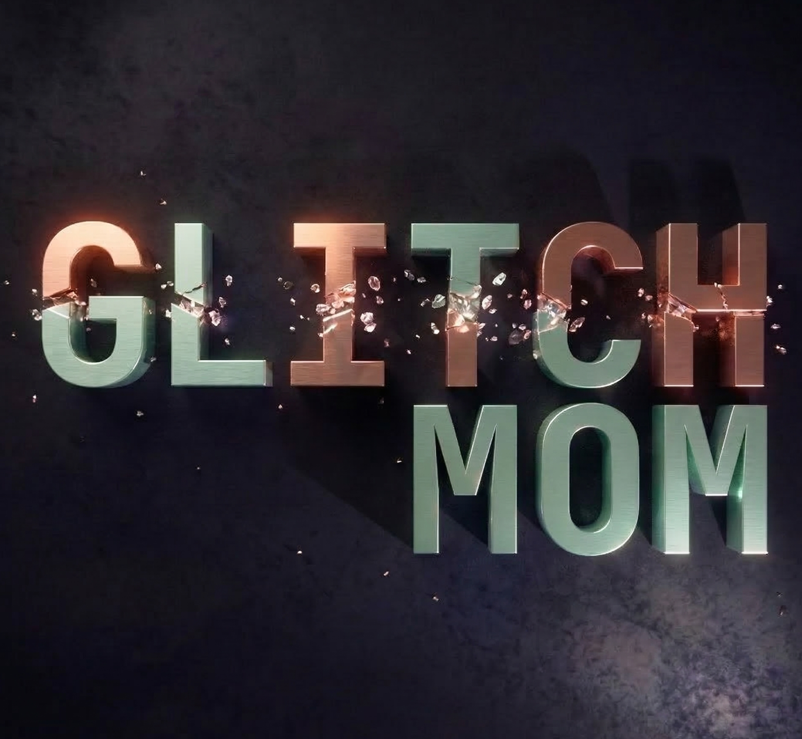

<p align="center">
  
</p>

<p align="center">
  
  
  
  
</p>

# 💖 GlitchMom Podcast

Bienvenida a GlitchMom, el podcast donde la tecnología y la maternidad se encuentran para crear comunidad, compartir historias y acompañarnos en cada glitch del día a día.

---

## 🌷 Nuestra historia

GlitchMom nació para dar voz a las madres que viven, sienten y transforman el mundo digital. Aquí celebramos los logros, aprendemos juntas y nos apoyamos en cada paso.  
Cada episodio es una invitación a conectar, reír, compartir y descubrir que no estamos solas en este viaje.

---

## ✨ Características

- Efectos visuales interactivos para episodios
- Diseño moderno y cálido
- Integración fácil de nuevos episodios
- Pensado para desktop, con advertencia para móvil

---


<p align="center">
  

</p>

---

## 📦 Instalación

```bash
git clone https://github.com/RuthDanielaAguirre/GlitchMom.git
cd GlitchMom/motherboard
pnpm install
pnpm run dev
```

---

## 📚 Estructura

```
motherboard/
├── src/
│   ├── components/
│   ├── types/
│   └── ...
├── public/
│   ├── glitchmom-banner.png
│   ├── glitchmom-podcast.png
│   └── glitchmom-art.png
├── .gitignore
├── README.md
└── package.json
```

---

## 🤝 Contribuye

Este proyecto es para ti, para nosotras.  
¿Tienes una historia, una idea o quieres mejorar la plataforma?  
Haz un fork, crea una rama y envía tu pull request. ¡Te esperamos!

---

## 📖 Licencia

MIT
